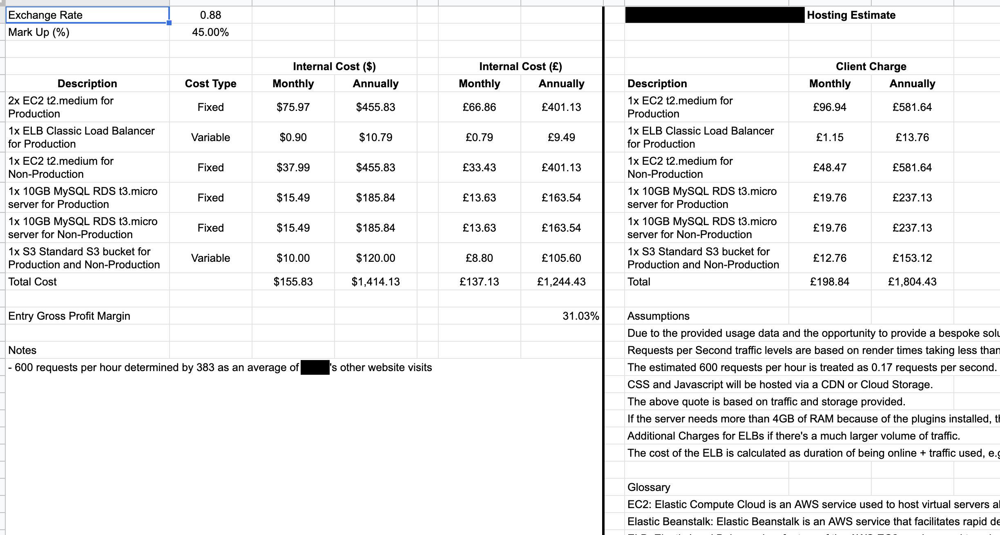

# Hosting Estimates
[Table of Contents](../readme.md)

## What Are Hosting Estimates For?
Hosting estimates are used by Engineering, Finance, and New Business to facilitate winning a new piece of work. They are calculated based on quantifiable values.

## How to Generate Hosting Estimates
By completing this [Google Form](https://docs.google.com/forms/d/e/1FAIpQLScsAvkcgkvUxp_JHr2hqZBIZ1BV9fMHsp7Z6wJBLozCTsqg8w/viewform) you'll be able to automatically generate a Hosting Estimate located in this [Google Drive](https://drive.google.com/drive/u/0/folders/1L86YZafMZ5q8awJEurnXk8iz-cXdbQED) folder. 

Each estimate is catalogued based on the `Client Name`, the first quetsion in the google form. If you have multiple hosting estimates for the same client but under different projects, it's recommended to add the project name too, e.g. `Hilton - Master API`.

After the estimate is generated you'll be required to add notes for Finance to review, and then send the estimate to Finance asking for a review on the `hosting` slack channel.

## Adding Notes
The below image is that of a Hosting Estimate to accommodate a new website. Everything right of the thick black line is meant for the client, everything to the left is for internal use only.

Below the `Entry Gross Profit Margin` should be the `Notes` manually added by the DevOps generating the Hosting Estimate. These notes need to include where the quantifiable numbers used to generate the estimate came from, either from the client or internally by 383 based on another project. This information is important as it informs Finance if they need to adjust the `Mark Up (%)`.

## The difference Between Server and Serverless Hosting
Server based hosting is typically a virtual machine running a Linux Operating System, Apache or Nginx, PHP and it's extensions, and Certbot to auto generate Let's Encrypt SSL certificates. This virtual server will be operating 24/7 in order to service the website/webapp.

Serverless based hosting operates using a skeleton frame, often a HTML file with one or many supporting JavaScript files, that requests all the content to be populated through an API. So instead of a server used to render the HTML, a serverless infrastructure will commonly send the information through JSON objects detailing everything the client will need to render the output. This means that the server is only available on API requests and is only costing the hosting provider based on demand.